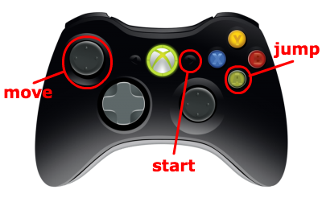
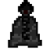
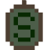
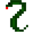
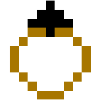

## Help Harry!

Help Harry! is a fun platformer game that runs using [Python](https://www.python.org/). In the game, the player's goal is to collect 7 horcruxes, one from each level, in order to help Harry Potter defeat Lord Voldemort.

### How do I Get the Game?

Help Harry! Is free to download, you just need to make sure you have the required software to run the game. 

You'll need Python 2 **?????**, which you can download [here](https://www.python.org/downloads/windows/) for Windows (you'll have to scroll down a bit). The game also requires pygame, which can be downloaded on [pygame's website](https://www.pygame.org/).

[This](https://github.com/zoe-stuart/harry-potter-platformer/archive/master.zip) is a direct link to download a zip archive of the code, or you can visit my GitHub repository [here](https://github.com/zoe-stuart/harry-potter-platformer).

The only other equipment required is a Xbox 360 controller, which can be easily purchased on [Amazon](https://www.amazon.com/Microsoft-Wired-Controller-Windows-Console/dp/B004QRKWLA), at the [Xbox website](http://www.xbox.com/en-US/xbox-one/accessories/controllers/controller-cable-windows), or a multitude of other places.

Now you can start playing!

### How do I Play?

Gameplay is simple. Once you have plugged in your controller and run the game, use the start button to start playing and move on to the lext level, the left joystick to move and the A button to jump.

You'll encounter various objects and enemies throughout the game. It's important that you know what they do. 

1. **A Pixie** is an enemy- if you run into it, you will lose a heart. You can kill it and earn 10 points by jumping on its head **twice**. 
2. **A Dementor** is also an enemy, and will have the same negative effect, but it's a little weaker. Jump on its head just once to kill it and earn 5 points. 
3. **Horcruxes** are located throughout each level, and are your goal. Collect them and exit the door at the end to move on to the next level. They come in many different forms, so keep an eye out for any of them.
      

4. **Hedwig** is there to help you. She'll either be carrying a medi-kit, like the one shown, or a small heart. Jump up to collect it from her and you'll get a health boost of either a life or a heart. 
